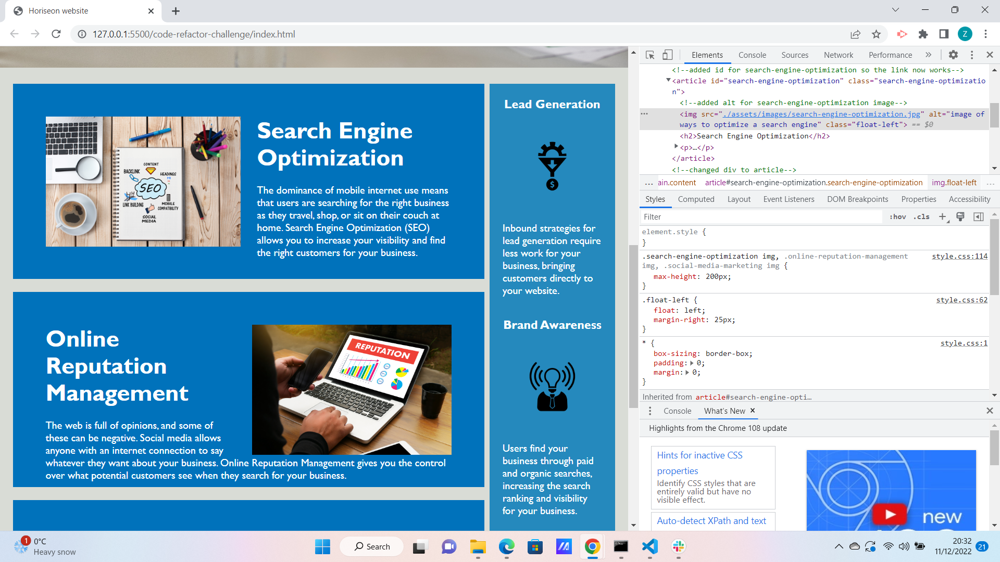

# Code-Refactor Challenge

## Description

This project demonstrates my ability to refactor code as I was given starter-code and was given the task of optimizing the HTML and CSS aspects so that it would be more accessible for the viewer. For example, people with disabilities would be able to access the code which would mean the website could reach a larger audience and the code would meet accessibility standards. Semantic elements have been included throughout so that there is a more logical structure to the code.

## Installation

N/A

## Usage

To use the website, you would use this link: https://zubeidadhupli.github.io/code-refactor-challenge/ .The link should take you to where the site is live and you can use the DevTools console, using Command+Option+I for macOS or Control+Shift+I for Windows, to read the comments in the Elements to see what was changed to make the code more semantic. Here is a screenshot that displays this feature in action: 

## License

MIT license that was chosen when I first created the repository.